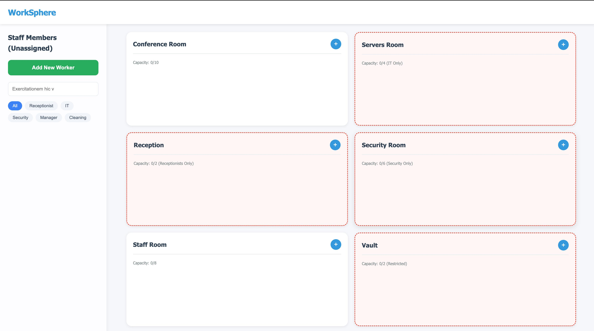
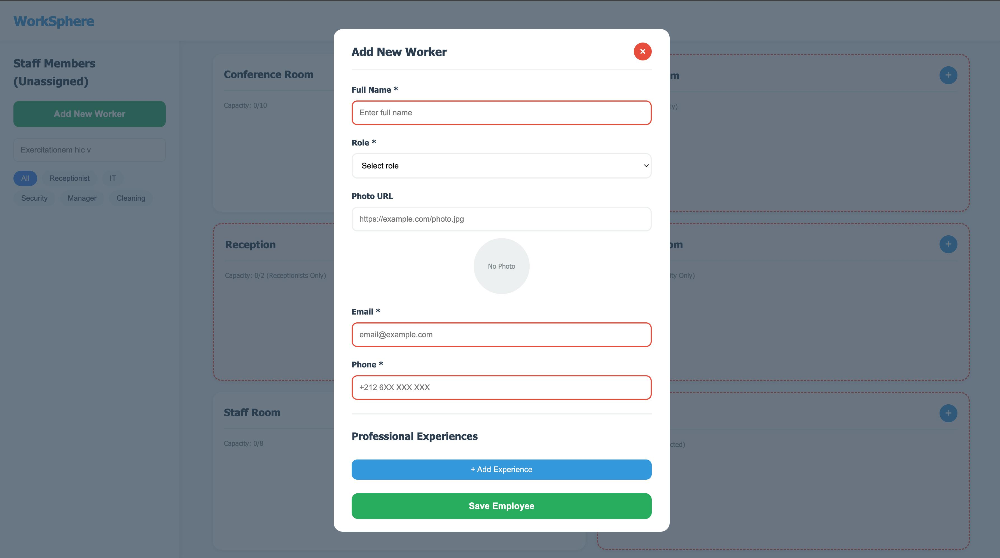
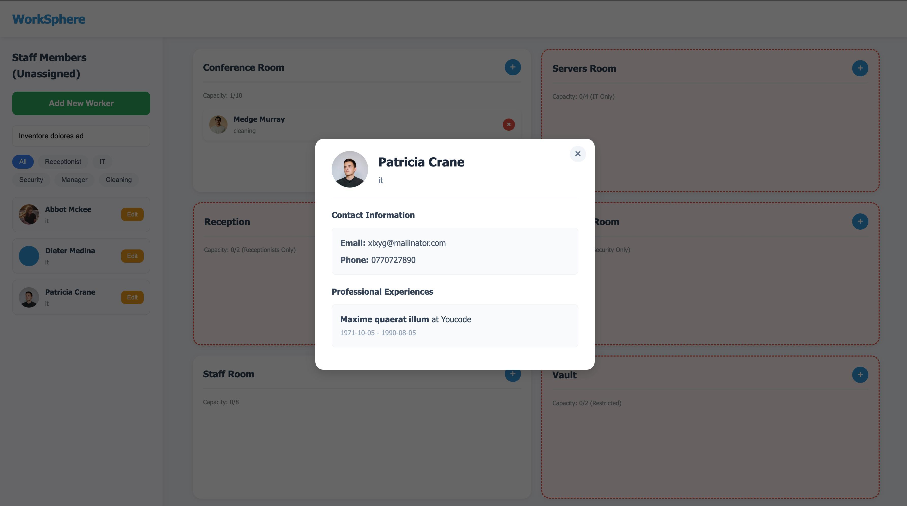
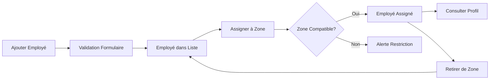

<div align="center">


# 🌐 WorkSphere
### *Application Web Intelligente de Gestion du Personnel*

[](LICENSE)
[](https://developer.mozilla.org/fr/docs/Web/HTML)
[](https://developer.mozilla.org/fr/docs/Web/CSS)
[](https://developer.mozilla.org/fr/docs/Web/JavaScript)

**Solution moderne et élégante pour optimiser la gestion de vos employés et l'affectation intelligente aux zones de travail**

[🚀 Démo Live](#) • [📖 Documentation](#installation-rapide) • [🐛 Signaler un Bug](https://github.com/yaakoub0tair/Workspace-Staff-Manager/issues) • [✨ Demander une Fonctionnalité](https://github.com/yaakoub0tair/Workspace-Staff-Manager/issues)

---



</div>

---

## 📑 Table des Matières

- [✨ Fonctionnalités](#-fonctionnalités-principales)
- [🎯 Pourquoi WorkSphere?](#-pourquoi-worksphere)
- [🎨 Aperçu Visuel](#-aperçu-visuel)
- [🚀 Installation](#-installation-rapide)
- [📖 Guide d'Utilisation](#-guide-dutilisation)
- [🏗️ Architecture](#️-architecture-du-projet)
- [🛠️ Technologies](#️-stack-technique)
- [📱 Responsive Design](#-design-responsive)
- [🎓 Concepts Clés](#-concepts-clés-implémentés)
- [🤝 Contribution](#-contribution)
- [📄 Licence](#-licence)

---

## ✨ Fonctionnalités Principales

<table>
<tr>
<td width="50%" valign="top">

### 👥 Gestion Complète des Employés

- ✅ **Ajout rapide** avec validation en temps réel
- ✏️ **Modification** intuitive des informations
- 🗑️ **Suppression** avec confirmation de sécurité
- 🔍 **Recherche dynamique** par nom ou rôle
- 📸 **Photos de profil** avec prévisualisation
- 💼 **Expériences professionnelles** multiples
- 📧 **Coordonnées complètes** (email, téléphone)

</td>
<td width="50%" valign="top">

### 🏢 Affectation Intelligente aux Zones

- 🎯 **6 zones de travail** prédéfinies
- 🔒 **Restrictions de rôles** automatiques
- 📊 **Capacités personnalisées** par zone
- ⚡ **Assignation drag-and-drop** intuitive
- 🚨 **Alertes visuelles** pour zones vides
- 👁️ **Modal de profil** détaillé
- 🔄 **Réaffectation** facile et rapide

</td>
</tr>
</table>

### 🗺️ Les 6 Zones de Travail

```
┌─────────────────┬──────────────┬──────────────┬──────────────┬──────────────┬──────────┐
│ Conference Room │  Reception   │   Servers    │   Security   │  Staff Room  │  Vault   │
│   (0/10) 🌐     │ (0/2) 🔒    │  (0/4) 🔒   │  (0/6) 🔒   │   (0/8) ☕   │ (0/2) 🔒│
└─────────────────┴──────────────┴──────────────┴──────────────┴──────────────┴──────────┘
```

| Zone | Capacité | Restrictions | Description |
|------|----------|--------------|-------------|
| 🎤 **Conference Room** | 10 | Ouverte | Salle de conférence principale |
| 🎯 **Reception** | 2 | Réceptionnistes uniquement | Point d'accueil visiteurs |
| 💻 **Servers Room** | 4 | IT uniquement | Salle serveurs sécurisée |
| 🛡️ **Security Room** | 6 | Agents de sécurité | Centre de surveillance |
| ☕ **Staff Room** | 8 | Ouverte | Espace détente employés |
| 🔐 **Vault** | 2 | Restreinte (pas Cleaning) | Coffre-fort sécurisé |

---

## 🎯 Pourquoi WorkSphere?

<table>
<tr>
<td width="33%" align="center">

### 🎨 Interface Moderne
Design épuré et intuitif<br>inspiré des meilleures pratiques UX

</td>
<td width="33%" align="center">

### ⚡ Performance Optimale
Code JavaScript modulaire<br>et optimisé pour la vitesse

</td>
<td width="33%" align="center">

### 📱 100% Responsive
Fonctionne parfaitement sur<br>tous les appareils

</td>
</tr>
</table>

---

## 🎨 Aperçu Visuel

<details open>
<summary><b>📊 Dashboard Principal</b></summary>
<br>


*Vue d'ensemble avec sidebar des employés non assignés et grille des 6 zones de travail*
</details>

<details>
<summary><b>➕ Formulaire d'Ajout d'Employé</b></summary>
<br>



*Formulaire complet avec validation en temps réel, prévisualisation photo et gestion des expériences*
</details>

<details>
<summary><b>👤 Modal de Profil Détaillé</b></summary>
<br>



*Affichage élégant des informations complètes de l'employé avec historique professionnel*
</details>

---

## 🚀 Installation Rapide

### Prérequis
- Un navigateur web moderne (Chrome, Firefox, Safari, Edge)
- Un éditeur de code (VS Code recommandé)
- Connaissances de base en HTML/CSS/JavaScript

### Option 1 : Installation Simple

```bash
# 1️⃣ Cloner le dépôt
git clone https://github.com/yaakoub0tair/Workspace-Staff-Manager.git

# 2️⃣ Accéder au répertoire
cd Workspace-Staff-Manager

# 3️⃣ Ouvrir dans le navigateur
# Double-cliquer sur index.html
```

### Option 2 : Avec Serveur Local (Recommandé)

```bash
# Avec Python 3.x
python -m http.server 8000

# Avec Node.js et npx
npx serve

# Avec PHP
php -S localhost:8000

# Avec Live Server (VS Code Extension)
# Clic droit sur index.html → "Open with Live Server"
```

Puis ouvrir `http://localhost:8000` dans votre navigateur préféré.

---

## 📖 Guide d'Utilisation

### 🎯 Actions Principales

<table>
<tr>
<th width="20%">Action</th>
<th width="30%">Comment faire</th>
<th width="50%">Détails</th>
</tr>
<tr>
<td>➕ <b>Ajouter</b></td>
<td>Cliquer sur "Add New Worker"</td>
<td>Remplir le formulaire avec nom, rôle, email, téléphone, photo optionnelle et expériences professionnelles</td>
</tr>
<tr>
<td>🔍 <b>Rechercher</b></td>
<td>Utiliser la barre de recherche</td>
<td>Taper le nom ou filtrer par rôle avec les boutons (All, Receptionist, IT, Security, Manager, Cleaning)</td>
</tr>
<tr>
<td>👁️ <b>Consulter</b></td>
<td>Cliquer sur un employé</td>
<td>Ouvre un modal avec profil complet, coordonnées et historique professionnel</td>
</tr>
<tr>
<td>🏢 <b>Assigner</b></td>
<td>Bouton "+" dans une zone</td>
<td>Sélectionner un employé éligible dans la liste des non-assignés</td>
</tr>
<tr>
<td>✏️ <b>Modifier</b></td>
<td>Bouton "Edit" sur un employé</td>
<td>Éditer les informations directement (fonctionnalité à venir)</td>
</tr>
<tr>
<td>🗑️ <b>Retirer</b></td>
<td>Bouton "×" sur un employé assigné</td>
<td>Retirer l'employé de la zone et le renvoyer dans la liste non-assignés</td>
</tr>
</table>

### 📋 Workflow Typique



---

## 🏗️ Architecture du Projet

### 📂 Structure des Fichiers

```
WorkSphere/
│
├── 📄 index.html                           # Page principale (structure HTML)
├── 🔧 .gitignore                           # Configuration Git
├── 📝 README.md                            # Documentation (ce fichier)
│
├── 📁 css/
│   ├── style.css                           # Point d'entrée CSS (imports)
│   └── components/
│       ├── navbar.css                      # 🧭 Navigation principale
│       ├── sidebar.css                     # 📋 Barre latérale employés
│       ├── zones.css                       # 🏢 Zones de travail
│       ├── modal.css                       # 🪟 Fenêtres modales
│       ├── forms.css                       # 📝 Formulaires
│       ├── cards.css                       # 🃏 Cartes employés
│       └── responsive.css                  # 📱 Media queries responsive
│
├── 📁 js/
│   ├── modules/
│   │   ├── main.js                         # 🎯 Point d'entrée JavaScript
│   │   ├── dom.js                          # 🔗 Références aux éléments DOM
│   │   ├── employees.js                    # 👥 Logique gestion employés
│   │   ├── form.js                         # 📝 Gestion formulaires
│   │   ├── modal.js                        # 🪟 Gestion modales
│   │   ├── validation.js                   # ✅ Validation des données
│   │   └── zones.js                        # 🏢 Logique zones de travail
│   └── (fichiers legacy non utilisés)
│
└── 📁 assets/
    ├── dashboard.png                       # 🖼️ Capture dashboard
    ├── add-worker.png                      # 🖼️ Capture formulaire
    └── profile-modal.png                   # 🖼️ Capture profil
```

### 🔄 Flux de Données

```
┌─────────────┐      ┌──────────────┐      ┌─────────────┐
│   DOM.js    │ ───► │  modules/*.js │ ───► │  index.html │
│  Références │      │    Logique    │      │     UI      │
└─────────────┘      └──────────────┘      └─────────────┘
                            │
                            ▼
                    ┌──────────────┐
                    │ LocalStorage │
                    │   (futur)    │
                    └──────────────┘
```

### 🧩 Modules JavaScript

| Module | Responsabilité | Fonctions Clés |
|--------|---------------|----------------|
| **main.js** | Initialisation application | `initModal()`, `initWorkerForm()`, `initializeZones()` |
| **dom.js** | Références DOM centralisées | Exporte objet `DOM` avec tous les sélecteurs |
| **employees.js** | Gestion employés | `addWorkerToList()`, `showProfileModal()` |
| **form.js** | Formulaires | `initWorkerForm()`, `initExperienceForm()` |
| **modal.js** | Modales | `initModal()` - gestion ouverture/fermeture |
| **validation.js** | Validation | `validateFullName()`, `validateEmail()`, `validatePhone()`, `validateURL()` |
| **zones.js** | Zones de travail | `initializeZones()`, `addWorkerToZone()`, `isWorkerEligible()` |

---

## 🛠️ Stack Technique

<div align="center">

### Technologies Utilisées

| Technologie | Version | Utilisation | Documentation |
|:-----------:|:-------:|:-----------:|:-------------:|
|  | 5 | Structure sémantique | [MDN HTML](https://developer.mozilla.org/fr/docs/Web/HTML) |
|  | 3 | Styles & animations | [MDN CSS](https://developer.mozilla.org/fr/docs/Web/CSS) |
|  | ES6+ | Logique interactive | [MDN JavaScript](https://developer.mozilla.org/fr/docs/Web/JavaScript) |

</div>

### 🎯 Paradigmes & Patterns

- ✅ **ES6 Modules** - Code modulaire et réutilisable
- ✅ **Programmation Fonctionnelle** - Fonctions pure et immutabilité
- ✅ **Event-Driven Architecture** - Gestion événements DOM
- ✅ **Component-Based CSS** - Styles modulaires et maintenables
- ✅ **Responsive First** - Design adaptatif mobile-first
- ✅ **Progressive Enhancement** - Fonctionnalités selon capacités navigateur

---

## 📱 Design Responsive

### 📊 Breakpoints

<div align="center">

| 🖥️ Desktop | 💻 Laptop | 📱 Tablet | 📱 Mobile | 📱 Small |
|:----------:|:---------:|:---------:|:---------:|:--------:|
| ≥ 1025px | 769-1024px | 481-768px | 401-480px | ≤ 400px |

</div>

### 🎨 Adaptations par Écran

<details>
<summary><b>🖥️ Desktop (≥ 1025px)</b></summary>

```css
/* Layout optimal avec sidebar fixe */
.main {
  display: flex;
  flex-direction: row;
}

.sidebar {
  width: 320px;
  position: fixed;
}

.zones {
  grid-template-columns: repeat(2, 1fr);
  gap: 20px;
}
```

**Caractéristiques:**
- Sidebar fixe à gauche (320px)
- Grille 2 colonnes pour les zones
- Tous les éléments visibles simultanément
- Espacement généreux (20-24px)

</details>

<details>
<summary><b>💻 Laptop (769-1024px)</b></summary>

```css
@media (max-width: 1024px) {
  .main {
    flex-direction: column;
  }
  
  .sidebar {
    width: 100%;
    position: relative;
  }
  
  .zones {
    grid-template-columns: 1fr;
    padding: 16px;
  }
}
```

**Caractéristiques:**
- Layout vertical (sidebar au-dessus)
- Zones en colonne unique
- Réduction des espacements
- Optimisation de la hauteur

</details>

<details>
<summary><b>📱 Tablet (481-768px)</b></summary>

```css
@media (max-width: 768px) {
  .staff-card {
    padding: 12px;
    flex-wrap: wrap;
  }
  
  .modal-content {
    width: 94%;
    max-width: 420px;
  }
  
  .zone {
    padding: 16px;
    min-height: 180px;
  }
}
```

**Caractéristiques:**
- Cartes employés plus compactes
- Modales adaptées (94% largeur)
- Boutons plus accessibles
- Textes légèrement réduits

</details>

<details>
<summary><b>📱 Mobile (≤ 480px)</b></summary>

```css
@media (max-width: 480px) {
  .staff-card {
    flex-direction: column;
    align-items: center;
    text-align: center;
  }
  
  .zone-name {
    font-size: 18px;
  }
  
  .btn-add-zone {
    padding: 10px 16px;
    border-radius: 18px;
  }
}
```

**Caractéristiques:**
- Interface verticale complète
- Boutons tactiles optimisés (min 44px)
- Typographie adaptée
- Espacement réduit intelligemment

</details>

---

## 🎓 Concepts Clés Implémentés

### 1️⃣ **ES6 Modules** 📦

```javascript
// dom.js - Export d'objet avec références DOM
export const DOM = {
  popupWorker: document.getElementById('popup-worker'),
  formWorker: document.getElementById('form-worker'),
  // ...
};

// main.js - Import et utilisation
import { DOM } from './modules/dom.js';
import { initWorkerForm } from './modules/form.js';
```

**Avantages:**
- ✅ Code organisé et modulaire
- ✅ Évite la pollution du scope global
- ✅ Facilite la maintenance
- ✅ Permet le tree-shaking

### 2️⃣ **Validation de Données** ✅

```javascript
// validation.js - Regex pour validation
export function validateEmail(email) {
  const re = /^[^\s@]+@[^\s@]+\.[^\s@]+$/;
  return re.test(email);
}

export function validatePhone(phone) {
  // Format Maroc: 0612345678 ou +212612345678
  const re = /^(0[67]\d{8}|\+212[67]\d{8})$/;
  return re.test(phone);
}
```

**Validations implémentées:**
- 📝 Nom complet (2-50 caractères, lettres uniquement)
- 📧 Email (format standard RFC)
- 📱 Téléphone (format marocain)
- 🌐 URL (validation native avec `new URL()`)

### 3️⃣ **Gestion d'État** 🔄

```javascript
// Stockage des données dans dataset
staffCard.dataset.employee = JSON.stringify(worker);

// Récupération et parsing
const workerData = JSON.parse(staffCard.dataset.employee);
```

**Pourquoi dataset?**
- ✅ Pas besoin de LocalStorage (pour l'instant)
- ✅ Données attachées directement aux éléments
- ✅ Facilite les interactions DOM
- ✅ Parfait pour prototype/MVP

### 4️⃣ **Logique de Restrictions** 🔒

```javascript
function isWorkerEligible(worker, zoneId) {
  const role = worker.role.toLowerCase().trim();
  
  // Manager peut aller partout
  if (role === 'manager') return true;
  
  // Cleaning interdit dans Vault
  if (role === 'cleaning' && zoneId === 'zone-vault') {
    return false;
  }
  
  // Restrictions spécifiques par zone
  switch (zoneId) {
    case 'zone-reception':
      return role === 'receptionist';
    case 'zone-servers':
      return role === 'it';
    case 'zone-security':
      return role === 'security';
  }
  
  return true; // Autres zones ouvertes
}
```

**Matrice de Restrictions:**

| Rôle | Conference | Reception | Servers | Security | Staff Room | Vault |
|------|:----------:|:---------:|:-------:|:--------:|:----------:|:-----:|
| Manager | ✅ | ✅ | ✅ | ✅ | ✅ | ✅ |
| Receptionist | ✅ | ✅ | ❌ | ❌ | ✅ | ✅ |
| IT | ✅ | ❌ | ✅ | ❌ | ✅ | ✅ |
| Security | ✅ | ❌ | ❌ | ✅ | ✅ | ✅ |
| Cleaning | ✅ | ❌ | ❌ | ❌ | ✅ | ❌ |

### 5️⃣ **CSS Modulaire** 🎨

```css
/* style.css - Point d'entrée avec imports */
@import url('components/navbar.css');
@import url('components/sidebar.css');
@import url('components/zones.css');
@import url('components/modal.css');
@import url('components/forms.css');
@import url('components/cards.css');
@import url('components/responsive.css');
```

**Avantages de l'approche:**
- ✅ Séparation des préoccupations
- ✅ Réutilisabilité des composants
- ✅ Maintenance simplifiée
- ✅ Chargement optimisé

### 6️⃣ **Animations CSS** ✨

```css
/* Animations fluides pour meilleure UX */
@keyframes slideIn {
  from {
    opacity: 0;
    transform: translateY(-50px);
  }
  to {
    opacity: 1;
    transform: translateY(0);
  }
}

.modal {
  transition: opacity 0.3s ease;
}

.modal.hidden {
  opacity: 0;
  pointer-events: none;
}
```

**Animations utilisées:**
- 🎭 Slide-in pour modales
- 🌊 Fade-in pour éléments
- 🔄 Rotation pour boutons close
- 📈 Scale pour hover effects

---

## 🚀 Roadmap & Améliorations Futures

### Phase 1 : Fonctionnalités Core ✅
- [x] Gestion CRUD des employés
- [x] Système de zones avec restrictions
- [x] Validation de formulaires
- [x] Design responsive complet
- [x] Modales et profils détaillés

### Phase 2 : Persistance des Données 🔄
- [ ] **LocalStorage** pour sauvegarder les données
- [ ] **Export CSV** des employés et affectations
- [ ] **Import CSV** pour ajout en masse
- [ ] **Système de backup** automatique

### Phase 3 : Fonctionnalités Avancées 🎯
- [ ] **Drag & Drop** pour réaffectation rapide
- [ ] **Historique** des mouvements d'employés
- [ ] **Statistiques** et tableaux de bord
- [ ] **Filtres avancés** multicritères
- [ ] **Mode sombre** avec toggle

### Phase 4 : Backend & API 🌐
- [ ] **API REST** avec Node.js/Express
- [ ] **Base de données** MongoDB/PostgreSQL
- [ ] **Authentification** utilisateurs
- [ ] **Permissions** par rôle (admin, manager)
- [ ] **Notifications** en temps réel

### Phase 5 : Features Entreprise 🏢
- [ ] **Support multilingue** (FR/EN/AR)
- [ ] **Planning** et horaires de travail
- [ ] **Gestion des congés** et absences
- [ ] **Rapports PDF** automatiques
- [ ] **Integration** avec systèmes RH

---

## 🤝 Contribution

Les contributions sont chaleureusement accueillies ! Voici comment vous pouvez aider :

### 🔀 Process de Contribution

1. **Fork** le projet
2. Créez votre branche feature
   ```bash
   git checkout -b feature/AmazingFeature
   ```
3. Committez vos changements
   ```bash
   git commit -m '✨ Add: Amazing new feature'
   ```
4. Push vers la branche
   ```bash
   git push origin feature/AmazingFeature
   ```
5. Ouvrez une **Pull Request**

### 📝 Conventions de Commit

Utilisez [Conventional Commits](https://www.conventionalcommits.org/):

```
✨ feat: Ajout d'une nouvelle fonctionnalité
🐛 fix: Correction d'un bug
📝 docs: Mise à jour documentation
💄 style: Changements de style (CSS)
♻️ refactor: Refactoring du code
⚡ perf: Amélioration de performance
✅ test: Ajout de tests
🔧 chore: Tâches de maintenance
```

### 🐛 Signaler un Bug

Ouvrez une [issue](https://github.com/yaakoub0tair/Workspace-Staff-Manager/issues) avec:
- Description claire du bug
- Steps pour reproduire
- Comportement attendu vs obtenu
- Screenshots si possible
- Navigateur et version

### 💡 Proposer une Fonctionnalité

Ouvrez une [issue](https://github.com/yaakoub0tair/Workspace-Staff-Manager/issues) avec:
- Description détaillée de la feature
- Use cases et bénéfices
- Mockups ou wireframes (bonus)
- Complexité estimée

---

## 📄 Licence

Ce projet est sous licence **MIT** - Voir le fichier [LICENSE](LICENSE) pour plus de détails.

```
MIT License

Copyright (c) 2024 Yaakoub Otair

Permission is hereby granted, free of charge, to any person obtaining a copy
of this software and associated documentation files (the "Software"), to deal
in the Software without restriction, including without limitation the rights
to use, copy, modify, merge, publish, distribute, sublicense, and/or sell
copies of the Software, and to permit persons to whom the Software is
furnished to do so, subject to the following conditions:

[Texte complet de la licence MIT...]
```

---

## 🙏 Remerciements

- [MDN Web Docs](https://developer.mozilla.org/) - Documentation technique
- [Font Awesome](https://fontawesome.com/) - Icônes (si utilisées)
- [Google Fonts](https://fonts.google.com/) - Typographie Segoe UI
- Communauté open-source pour l'inspiration

---

## 👨‍💻 Auteur

<div align="center">

**Développé avec ❤️ et ☕ par [Yaakoub Otair](https://github.com/yaakoub0tair)**

[](https://github.com/yaakoub0tair)
[![LinkedIn](https://img.shields.io/badge/LinkedIn-0077B5?style=for-the-badge&logo=linkedin&logoColor=white